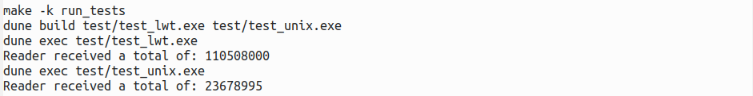

# Tjr_mem_queue, a simple inter-thread messaging library

## Introduction

This is a simple messaging library, eg to be used for Lwt messaging. 

The library `tjr_mem_queue` contains a generic version of the interface. Then `...lwt` contains the lwt instance, and `...unix` contains the unix instance.

There are tests in test/. You need to build and install the libraries
before building and running the tests.

## Quick links

* Online **ocamldoc** documentation can be found
  [here](https://tomjridge.github.io/tjr_mem_queue/index.html).

## Build and install

Type `make` to build and install.

Then type `make run_tests` to run the tests. The tests run the lwt and unix implementations for 10s, with 3 writers and a single reader. The result should look something like this:

## Dependencies

| Dependency     | Comment                     |
| -------------- | --------------------------- |
| lwt            | For lwt instance            |
| unix? threads? | For unix instance           |
| tjr_monad      | For generic monad interface |
